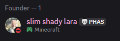
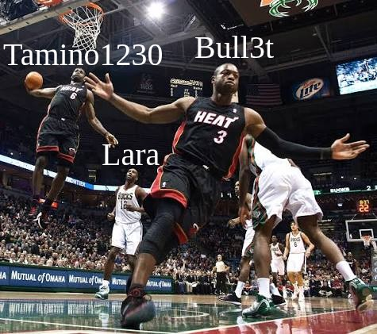

# Hello lovely stay members
 

> [!NOTE]
> The Person:
> 
> id: 1106685608610517002

to join: 
[Our Dev Discord Server](https://discord.gg/Ja4SjVJMUX) 
[Tamino1230's Discord Server](https://discord.gg/7EK2yrq92Z)

## Accusation
We the dev's [CallMeBull3t](https://github.com/CallMeBull3t) and [Tamino1230](https://github.com/Tamino1230) have been working on StayHere for almost 2 years. 
The person has no right to the project-source-code & discord server. 
In this message we will talk about all previus and now members and what all happens.

"Its a friends project" she said. 
but she as the `founder and developer` never has written code in these two years. 

The source code is in our hands because `the person` has never made anything, brought people to us, with `server programming skill`, for stuff we never intended to do, wanting us to implement payment before even the features are made and **not knowing** how `servers/hosting` even works.

## The person
`The person` does no care about his developers who do all her work. It was supposed to be a `friends project` but it turned out with a `evil ceo` :c 
<!-- She was mentally manipulating for a while, thats the reason i stopped, hidden, not in the official readme -->
Never appreciating the work we have done for (her saying) "her project" 
As: 
https://github.com/justpleaseSTAYhere 
https://github.com/justpleaseSTAYhere/stay-reconnect 
(was complaining about it because my name was on the page as person who made it because: "Then it would look like `the person` wouldnt do anything.") 
https://github.com/justpleaseSTAYhere/StayHooks 
(Never said anything)

##  AI everywhere
`The person` doesnt really know any program. Atleast in the project. 
Any code she has ever done for stay, was AI generated `slop`. 
The only contribution she has made was a 2,300 code lines file made completely with ChatGPT/Gemini that would not work in production.
The whole source code can be viewed here: [1106685608610517002's_source_code](src\source-code\1106685608610517002's_source_code.html) [1106685608610517002'stermsofuse](src\source-code\1106685608610517002'stermsofuse.html)

## Gold3nDreams
Was the head of Socials and the Discord Server, eventually left because he couldnt hold `the person` anymore. They had just an argument. All people which are joining the server eventually came from He/Xe.

## Slow down of the progress
- `The person` deleted the dev discord server one day, because she felt like she didnt need it.
- `The person` talks on the server like she has done all by herself and Impersonating being a dev.
- I have send the code over multiple times + varius working versions, `the person` never had reviewed them so also has never even seen the source code.

## Again here.fm
Someone picked up the official here.fm project, its very buggy at the moment but you can visit it here: [again.here.fm](https://again.here.fm/) so no need for `the person which hasnt done anything either way`

## Final word

A beautiful image made by bull3t. (😭) 
This is our view of point we made for you all to read. 